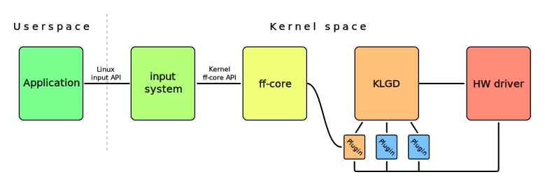

KLGD
===

Introduction
---

This software of the interim name KLGD (Kernel Library for Gaming Devices) was written to deal with a problem that arises when a real-time output has to be delivered to devices with high output latency. Applications that need to send data to various gaming devices to drive Force Feedback effects effects etc. can generate events for those devices at a very high rate. When that happens, the device might start to lag behind the application that controls it or drop some events altogether. This is obviously undesirable and leads to a very degraded user experience. The problem is demonstrated on the current Linux implementation of Force Feedback, but it is not specific to it.

Layout of the Force Feedback infrastructure in the Linux kernel is shown on the following scheme:

Whenever a userspace makes a call either by ioctl or by writing to the device through a file descriptor, the call falls through this entire chain and ends up with the hardware driver writing to the device. The actual delivery of the payload to the device is handled by the kernel internals and it depends on the communication protocol the device uses. It is evident that when the target device cannot cope with incoming data fast enough the problem described above occurs.

Solution
---
KLDG decouples the process of handling userspace requests from the process of uploading these requests to devices. When a userspace request arrives, its result is stored within a plugin responsible for handling that request. The plugin then tells KLGD when(and if) it needs to deliver new data to the device. A simple design with a workqueue and two spinlocks makes sure that everything is kept in a consistent state. Spinlocking also ensures that no data will be sent to the device until the previous payload has been fully processed. KLGD however relies on the underlying hardware driver to not buffer or queue the outgoing payload anywhere.
Layout of the infrastructure involving KLGD looks like this: 

Operation
---
Basic operation of KLGD and the interaction with its plugins can be described as a following series of steps:

1. A plugin receives an event from userspace and tells KLGD to schedule an update at appropriate time.
2. When the timer fires, KLGD goes over all its plugins and asks them for data they need to send to the device.
3. The obtained command stream is then passed to the hardware driver and delivered to the device.
4. KLGD queries all plugins again to check if there is any more data to be sent to the device at some point in the future.

### Important remarks

* Keep in mind that KLGD itself never interfaces directly with userspace. All userspace interactions are supposed to be handled by the plugins.
* The command stream generated by KLGD is not supposed to require any additional post-processing by the hardware driver. Ideally it should be a raw sequence of bytes that can be sent to the device right away.
* With the above in mind it should be evident that the plugins need to generate commands specific for the given hardware.
